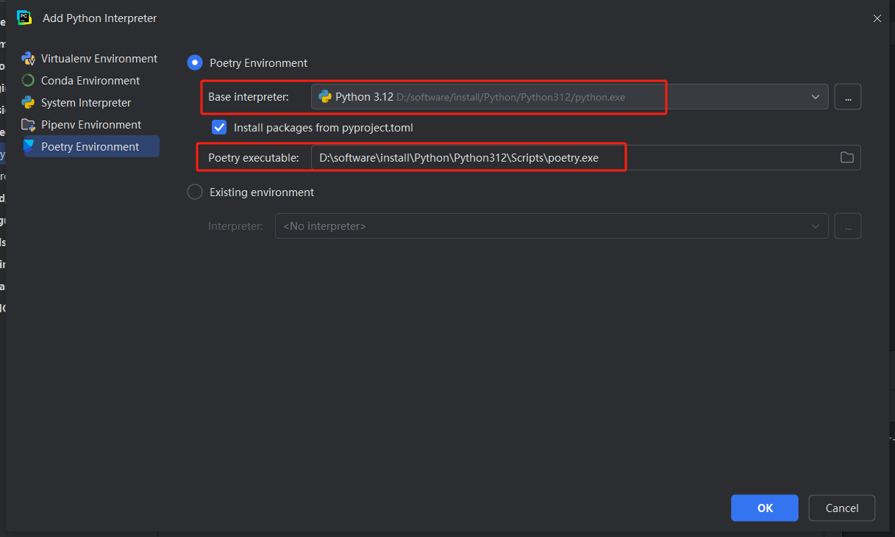
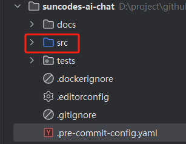

# suncodes-ai-chat

## 1. 概览

suncodes-ai-chat 工程用于AI聊天服务。

> 参考：https://github.com/pyloong/cookiecutter-pythonic-project/tree/main

> pyproject.toml 文件中，默认添加了一些开发环境中常用的工具。
> 
> - isort: isort 是一个自动格式化导入工具
> - pylint: pylint 是一个检测代码风格工具
> - pytest: pytest 是一个更加易用的测试框架，兼容 unittest 测试框架
> - pytest-cov: pytest-cov 是 pytest 的 Coverage 插件，用来统计测试覆盖率
> - mkdocs: mkdocs 是一个项目文档构建工具，使用 markdown 编写内容，构建生成文档页面。
> - mkdocs-material: mkdocs-material 是基于 mkdocs 构建文档，并提供现代化主题的库。
> - tox: tox 是一个任务自动化工具

⚠️ <font color=red> 不再使用 requirements.txt，而是使用 poetry 管理依赖。</font>


## 2. 使用

### 2.1 初始化工程

- 前提：下载 `poetry`
```text
pip install poetry
pip install tox

# 自定义虚拟环境缓存路径（可选）
poetry config cache-dir "D:\\software\\install\\poetry-cache\\Cache"
```

- 拉取工程：git clone/pull
- 下载工程依赖
```bash
poetry install
```

### 2.2 使用并运行

命令行运行：
```text
poetry run python src/suncodes_ai_chat/main.py
```

参考：[Poetry 基本用法](./docs/Poetry 基本用法.md)

## 3. 使用Pycharm IDE（代替 2.2 项）

前提：安装 Poetry
```text
pip install poetry

# 自定义虚拟环境缓存路径（可选）
poetry config cache-dir "D:\\software\\install\\poetry-cache\\Cache"
```

1. 打开项目
2. Pycharm IDE 配置 `poetry` 环境
（如果配置过，会自动根据 `pyproject.toml` 识别 `poetry` 环境，无需手动配置）

File ---> settings --->Project:xxx ---> Python Interpreter ---> Add Interpreter ---> Add Local Interpreter.

选择 Poetry Environment：

​​

‍

在 Poetry executable 中，添加之前安装 poetry 的安装目录。${python install dir}/Scripts/poetry.exe


3. 运行项目：直接在 main.py（任意.py文件均可） 中右键 Run


`注意：！！！`（按理说 poetry 配置环境，会自动把 src 目录为 sources 目录）

如果报错：Module can not import in src，则需要把 src 和 tests 目录设置为 sources 目录
- 设置方式1： `File` --> `Settings` --> `Project Settings` --> `Project Structure`，标记`src`和`tests`目录为`Sources`
- 设置方式2： 鼠标悬浮在 `src` 目录，右键 --> `Mark Directory As` --> `Sources Root`

 

## 4. 关于日志

- 目前默认使用 `logging` 模块，自定义了 `logger` 配置。
- 日志配置在 suncodes-ai-chat-dev/test.yml 配置文件中。
- 目前配置文件写在了 suncodes_ai_chat/config 目录下，后续会转移到 config-repo 统一管理。
- 日志格式参考 springboot 日志格式。

## 5. 关于环境

- 目前支持 `dev`,`test`,`pre-staging`,`staging`,`prod`五种环境。
- 环境设置方式：（优先级从高到低）
  - 命令行参数：`--env dev` 或 `-e dev`
  - 系统环境变量：`PYTHON_PROFILES_ACTIVATE`（k8s-objects配置）
  - pyproject.toml 文件中配置：`suncodes.env`
  - 默认环境：`dev`
- 根据不同的环境，加载不同环境的配置文件。多个环境配置文件会合并成一个配置文件。

